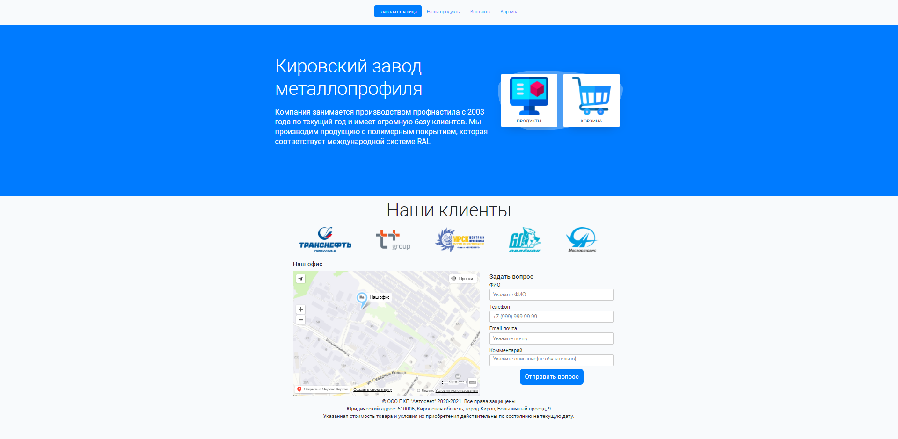
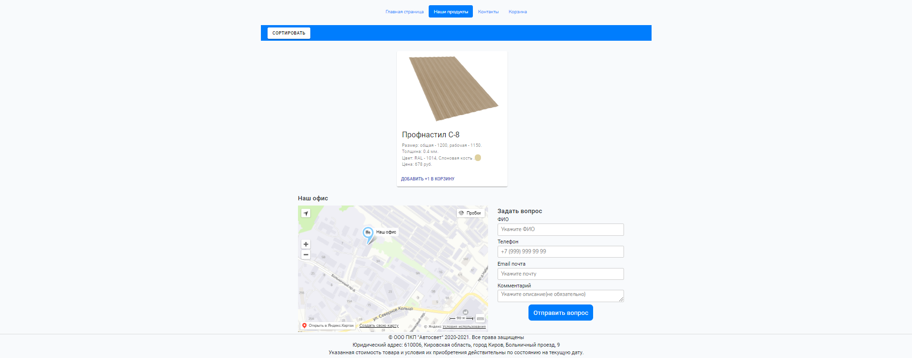
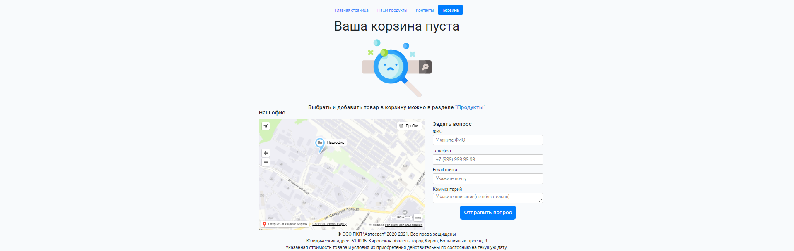
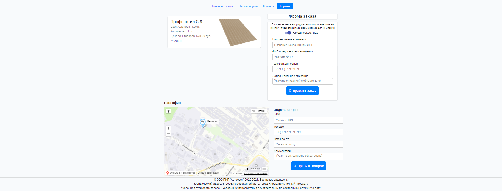
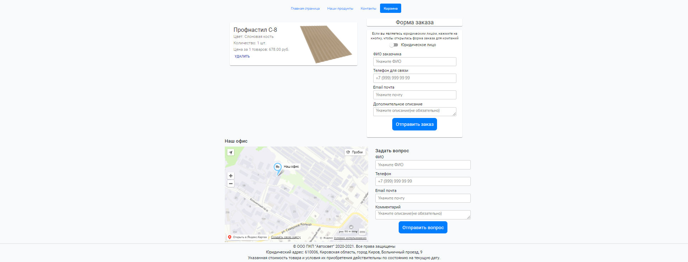
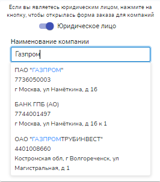
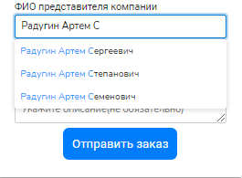

## Главная страница

Главная страница является родительской страницей, с которой начинается работа. Пользователь может выбрать в верхней навигации любую страницу и мгновенно перейдёт на неё. Также присутствует навигация в элементе header. Если пользователь нажмёт на кнопку "Продукты" или "Корзина" он перейдет на соответствующую страницу. Внизу страницы имеется подвал, в котором отображается компании с её местонахождением и форма обратной связи с валидацией всех полей:

## Наши продукты

Страница отображает текущие продукты в базе данных, а также позволяет их сортировать. Нажав у продукта на кнопку "Добавить в корзину" 1 единица товара будет добавлена в корзину пользователя, если он захочет добавить ещё, он должен нажать на кнопку "Добавить +1 товар".

## Пустая корзина

Если товары в корзине отсутствуют, будет отображаться текущая страница

## Корзина товаров

Страница будет отображаться, если у пользователя есть хотя бы один товар в корзине. Пользователь может оформить заказ как юридическое/физическое лицо. Каждая форма имеет валидацию полей, и после успешно заполненных данных заказ будет добавлен в БД

## Всплывающие подсказки

В текущем проекте присутствует интеграция с сервисом dadata, который помогает пользователю быстрее получить доступ к данным. В полях "ФИО" и "Компания" при вводе начинают появлятся подсказки.

## Используемые технологии при разработки
- JavaScript.
- React.
- PHP.
- Laravel.
- HTML/CSS.
- MySQL.
